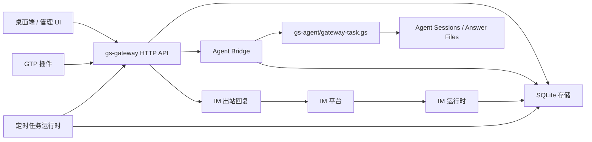

# IM / 定时任务 / 网关设计

> 更新日期：2026-06-08。
> 参考项目：`XingYu-Zhong/DeepSeek-GUI`，重点参考其运行时服务、IM 通道、定时任务和配置归一化设计。

## 目标

将 `gs-gateway` 重新定位为外部通道、定时 Agent 工作和 Agent 派发的持久化控制面。

这套设计保持一条清晰边界：

- `gs-gateway` 负责集成状态、定时任务状态、HTTP API、持久化、审计事件和任务派发。
- `gs-agent` 负责模型回合、工具执行、执行期 Skill、session 文件和最终答案。
- GTP 插件负责平台传输或脚本侧临时能力，不负责网关侧持久状态。

参考项目最值得借鉴的不是界面细节，而是这几个架构模式：小型运行时服务、边界输入归一化、显式任务状态、统一控制入口和清晰的执行边界。

## 设计原则

1. 在边界处归一化。

   IM webhook、插件事件、桌面端请求和定时任务创建请求，都先转换成网关拥有的标准记录，再进入 Agent 执行。下游代码不应反复解析平台差异化 payload。

2. 运行时服务可以有状态，但状态必须受控。

   网关服务可以持有内存中的运行集合、轮询定时器和健康状态。持久事实必须写入 SQLite。重启恢复基于持久记录，而不是隐藏的进程内存。

3. 使用统一任务信封。

   IM 消息、定时 prompt、桌面任务和插件任务都转换成 `gateway_tasks`。Agent 执行始终接收同一种 bridge payload 结构。

4. 区分持久调度和脚本 timer。

   `plugins/scheduler` 是给脚本使用的 GTP timer 插件。`gs-gateway` scheduler 是持久化的 Agent 任务调度器。两者可以协作，但不是同一个子系统。

5. 审计每一次状态变化。

   每条入站消息、每次 schedule tick、每次任务运行、每次 bridge 结果、每次 IM 出站回复都写入 `gateway_events`。

## 总体架构



网关仍然是唯一公开的管理 API。平台适配器和 schedule tick 只向网关输入事件或请求，不直接运行模型。

## 网关模块划分

建议模块结构：

```text
src/
  models/
    gateway.gs              # 组合根
    store.gs                # SQLite 表和迁移
    im_runtime.gs           # 通道、入站和出站归一化
    scheduler_runtime.gs    # 持久 schedules、tick、恢复、运行
    task_runtime.gs         # 任务状态机辅助逻辑
    agent_bridge.gs         # 只负责调用 gs-agent
  controllers/
    im_controller.gs
    scheduler_controller.gs
    task_controller.gs
    agent_bridge_controller.gs
```

`createGatewayModel()` 负责组合这些服务，并注入共享依赖：config、store、agent summary model 和 bridge model。

## IM 设计

IM 应从“单个入站接口”升级为“通道运行时”。

### 通道

一个通道描述一条已配置的 IM 连接：

```json
{
  "id": "im-feishu-main",
  "provider": "feishu",
  "adapter": "feishu-openapi",
  "label": "feishu agent",
  "enabled": true,
  "workspaceRoot": "",
  "model": "auto",
  "mode": "agent",
  "replyPolicy": "final",
  "createdAt": "2026-06-08T00:00:00.000Z",
  "updatedAt": "2026-06-08T00:00:00.000Z"
}
```

密钥应保存在本地配置或平台专用凭据存储中。SQLite 中的 channel 行可以存元数据和脱敏后的凭据摘要，但不应存明文 app secret，除非后续明确引入加密能力。

### 入站消息

所有平台的入站消息统一归一化为：

```json
{
  "source": "im",
  "channelId": "im-feishu-main",
  "provider": "feishu",
  "adapter": "feishu-openapi",
  "messageId": "om_xxx",
  "chatId": "oc_xxx",
  "threadId": "",
  "senderId": "ou_xxx",
  "senderName": "Alice",
  "replyTo": "oc_xxx",
  "text": "帮我检查今天的任务",
  "raw": {}
}
```

网关收到入站消息后：

1. 写入 `gateway_events(source="im", type="inbound_message")`。
2. 按 `channelId + chatId + threadId` upsert conversation 记录。
3. 创建 `gateway_tasks`，`kind="agent.im"`。
4. 根据通道策略决定是否立即派发。

### 出站回复

出站回复应由网关负责，因为它依赖通道状态、平台凭据和远端会话元数据。

bridge result 仍然是 Agent 执行结果，但回复发送由网关完成：

```json
{
  "taskId": "task-...",
  "channelId": "im-feishu-main",
  "conversationId": "conv-...",
  "replyTo": "oc_xxx",
  "text": "处理完成..."
}
```

这样网关可以记录 `im.reply_start`、`im.reply_done` 和 `im.reply_failed`，同时避免 `gs-agent` 接触平台凭据。

## 定时任务设计

网关 scheduler 应成为一个持久化运行时服务，而不是长期停留在 `dueAt <= now` 的简单转换器。

### Schedule 记录

推荐结构：

```json
{
  "id": "sch-...",
  "name": "Daily IM summary",
  "kind": "agent.schedule",
  "status": "active",
  "enabled": true,
  "schedule": {
    "type": "daily",
    "timeOfDay": "09:00",
    "timezone": "Asia/Shanghai",
    "nextRunAt": "2026-06-09T01:00:00.000Z"
  },
  "run": {
    "workspaceRoot": "",
    "model": "auto",
    "mode": "agent",
    "reasoningEffort": "medium",
    "prompt": "汇总昨天的 IM 待办"
  },
  "last": {
    "status": "idle",
    "runAt": "",
    "taskId": "",
    "message": ""
  }
}
```

初期支持的 schedule 类型应保持简单：

- `manual`：只保存，不自动运行。
- `at`：一次性运行，成功或失败后禁用。
- `interval`：每 N 分钟运行一次。
- `daily`：每天固定墙钟时间运行一次。

Cron 或 RRULE 可以后续再加。对当前阶段来说，显式 schedule 类型更容易校验，也更适合 UI 展示。

### 运行时行为

scheduler runtime 负责：

- `sync(config)`：启动或停止 tick 循环。
- `status()`：返回运行中的 schedule id 和下一次 tick 信息。
- `ensureNextRuns()`：补齐缺失的 `nextRunAt`。
- `tick(now)`：找到到期 schedule 并创建任务。
- `runSchedule(id)`：手动立即运行。
- `monitorTask(taskId)`：bridge 完成后更新 schedule 的 `last` 状态。

运行时可以维护内存中的 `runningScheduleIds`，避免同一进程内重复派发。SQLite 仍然是恢复和审计的事实来源。

### 重启恢复

启动时应执行：

1. 如果某个 schedule 的 `last.status="running"`，但内存里没有对应运行任务，则标记为 `error`。
2. 已经触发过的一次性 `at` schedule 禁用。
3. 活跃的重复 schedule 重新计算 `nextRunAt`。
4. 每次启动 tick 最多为同一个 schedule 创建一个补偿任务，避免重启后批量重复执行。

## Gateway Task 信封

所有可能调用 Agent 的网关任务都应使用同一 payload：

```json
{
  "taskId": "task-...",
  "id": "task-...",
  "kind": "agent.im",
  "name": "IM message from Alice",
  "root": "absolute/path/to/gs-agent",
  "source": {
    "type": "im",
    "eventId": "evt-...",
    "scheduleId": ""
  },
  "input": {
    "text": "...",
    "displayText": "...",
    "conversation": {},
    "schedule": {}
  },
  "run": {
    "workspaceRoot": "",
    "model": "auto",
    "mode": "agent",
    "reasoningEffort": "medium"
  },
  "payload": {}
}
```

`payload` 保留用于兼容旧代码。新代码应优先读取 `source`、`input` 和 `run`。

## 状态机

### Gateway Task

```text
pending -> running -> done
pending -> running -> failed
pending -> canceled
running -> failed
```

`done` 表示 Agent bridge 已经产出结果，不表示 IM 回复一定已经发送。

### Schedule

```text
active -> queued -> active
active -> running -> active
active -> paused
active -> disabled
active -> failed
```

`queued` 应是短暂状态。如果 bridge 仍是同步执行，可以跳过 `queued`，由创建出的 task 承载详细状态。

### IM Reply

```text
pending -> sending -> sent
pending -> sending -> failed
pending -> skipped
```

这个状态属于 reply 或审计记录，不属于 Agent task 本身。

## API 设计

保留已有 API，并补充聚焦的管理接口：

| 方法 | 路径 | 说明 |
|---|---|---|
| `GET` | `/api/im/channels` | 列出 IM 通道 |
| `POST` | `/api/im/channels` | 创建通道元数据 |
| `PATCH` | `/api/im/channels/:id` | 更新通道元数据 |
| `DELETE` | `/api/im/channels/:id` | 禁用或删除通道 |
| `GET` | `/api/im/conversations` | 列出归一化会话 |
| `POST` | `/api/im/inbound` | 现有入站入口 |
| `POST` | `/api/im/replies` | 发送或重试出站回复 |
| `GET` | `/api/schedules` | 现有 schedule 列表 |
| `POST` | `/api/schedules` | 创建持久 schedule |
| `POST` | `/api/schedules/:id/run` | 手动运行 |
| `POST` | `/api/schedules/tick` | 管理或测试用 tick |
| `GET` | `/api/scheduler/status` | scheduler 运行时健康状态 |

现有 `/api/schedules/run-due` 可以保留，作为 `/api/schedules/tick` 的兼容别名。

## 存储调整

建议新增表：

```text
gateway_im_channels
  id, provider, adapter, label, enabled, config, created_at, updated_at

gateway_im_conversations
  id, channel_id, chat_id, thread_id, sender_id, sender_name,
  agent_session_id, last_message_at, created_at, updated_at

gateway_im_replies
  id, task_id, channel_id, conversation_id, status, payload, result,
  created_at, updated_at

gateway_schedule_runs
  id, schedule_id, task_id, status, started_at, finished_at, result
```

现有 `gateway_tasks`、`gateway_schedules` 和 `gateway_events` 保留。

## 实施阶段

### 阶段 1：任务契约清理

- 新建 gateway task 时补齐 `source`、`input` 和 `run`。
- 保留 `payload.im` 和 `payload.text` 兼容。
- 更新 smoke test，断言 IM task 的归一化结构。

### 阶段 2：持久化 Scheduler Runtime

- 补充 `nextRunAt`、`lastStatus`、`lastTaskId` 和 `lastMessage` 语义。
- 用 `tick()` 加兼容包装替换单次 `dueToTasks()`。
- 增加手动运行接口 `/api/schedules/:id/run`。

### 阶段 3：IM Channel Runtime

- 增加 channel 和 conversation 记录。
- 入站消息基于 channel config 归一化。
- 保持 `/api/im/inbound` 作为统一外部入口。

### 阶段 4：回复 Bridge

- Agent bridge 成功后，如果来源是 IM 且通道策略允许，创建 pending reply。
- 通过 `@plugin/im-bot` 或平台适配器发送。
- 记录完整 reply 生命周期事件。

### 阶段 5：运行状态和 UI 就绪

- 增加 `/api/scheduler/status`。
- 增加 IM channel 和 conversation 查询。
- 让 event 记录足够支撑桌面端时间线。

## 非目标

- 不把模型 provider 配置移动到网关。
- 不让网关执行 coding tools。
- 不把 `plugins/scheduler` 变成网关持久 scheduler。
- 不要求所有 IM 平台在数据模型建立前都完整支持入站和出站。
- 在简单 schedule 类型证明不足前，不引入完整 cron parser。

